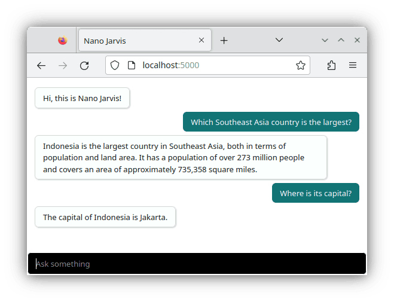

# Nano Jarvis



Nano Jarvis is compatible with either a cloud-based (managed) LLM service (e.g. [OpenAI GPT model](https://platform.openai.com/docs), [Grog](https://groq.com), [OpenRouter](https://openrouter.ai), etc) or with a locally hosted LLM server (e.g. [llama.cpp](https://github.com/ggerganov/llama.cpp), [LocalAI](https://localai.io), [Ollama](https://ollama.com), etc). Please continue reading for detailed instructions.

Requirement: [Node.js](https://nodejs.org) v18 or later.

Launch with:
```
./nano-jarvis.js
```
then open `localhost:5000` with your favorite web browser.

## Using Local LLM Servers

Supported local LLM servers include [llama.cpp](https://github.com/ggerganov/llama.cpp), [Jan](https://jan.ai), [Ollama](https://ollama.com), and [LocalAI](https://localai.io).

To utilize [llama.cpp](https://github.com/ggerganov/llama.cpp) locally with its inference engine, ensure to load a quantized model such as [Gemma 2B](https://huggingface.co/LiteLLMs/gemma-2b-it-GGUF), [Phi-3 Mini](https://huggingface.co/microsoft/Phi-3-mini-4k-instruct-gguf), or [LLama-3 8B](https://huggingface.co/QuantFactory/Meta-Llama-3-8B-Instruct-GGUF). Adjust the environment variable `LLM_API_BASE_URL` accordingly:
```bash
llama-server --hf-repo LiteLLMs/gemma-2b-it-GGUF --hf-file Q4_0/Q4_0-00001-of-00001.gguf
export LLM_API_BASE_URL=http://127.0.0.1:8080/v1
```

To use [Jan](https://jan.ai) with its local API server, refer to [its documentation](https://jan.ai/docs/local-api) and load a model like [Phi-3 Mini](https://huggingface.co/microsoft/Phi-3-mini-4k-instruct-gguf) or [LLama-3 8B](https://huggingface.co/QuantFactory/Meta-Llama-3-8B-Instruct-GGUF) and set the environment variable `LLM_API_BASE_URL`:
```bash
export LLM_API_BASE_URL=http://127.0.0.1:1337/v1
export LLM_CHAT_MODEL='llama3-8b-instruct'
```

To use [Ollama](https://ollama.com) locally, load a model and configure the environment variable `LLM_API_BASE_URL`:
```bash
ollama pull phi3
export LLM_API_BASE_URL=http://127.0.0.1:11434/v1
export LLM_CHAT_MODEL='phi3'
```

For [LocalAI](https://localai.io), initiate its container and adjust the environment variable `LLM_API_BASE_URL`:
```bash
docker run -ti -p 8080:8080 localai/localai tinyllama-chat
export LLM_API_BASE_URL=http://localhost:3928/v1
```

## Using Managed LLM Services

To use [OpenAI GPT model](https://platform.openai.com/docs), configure the environment variable `OPENAI_API_KEY` with your API key:
```bash
export OPENAI_API_KEY="sk-yourownapikey"
```

To use [OpenRouter](https://openrouter.ai/), select a model (e.g. [Mistral 7B](https://openrouter.ai/models/mistralai/mistral-7b-instruct), [LLama-3 8B](https://openrouter.ai/models/meta-llama/llama-3-8b-instruct), [OpenChat 3.6](https://openrouter.ai/models/openchat/openchat-8b), etc) and set the environment variables accordingly.
```bash
export LLM_API_BASE_URL=https://openrouter.ai/api/v1
export LLM_API_KEY="yourownapikey"
export LLM_CHAT_MODEL="meta-llama/llama-3-8b-instruct"
```

Nano Jarvis is also compatible with [Anyscale](https://www.anyscale.com), [Deep Infra](https://deepinfra.com), [Fireworks](https://fireworks.ai), [Groq](https://groq.com), [Lepton](https://lepton.ai), [Novita](https://novita.ai), [Octo](https://octo.ai), and [Together](https://www.together.ai). For details on how to configure the environment variables for each of these services, refer to the documentation of the sister project, [Ask LLM](https://github.com/ariya/ask-llm).
